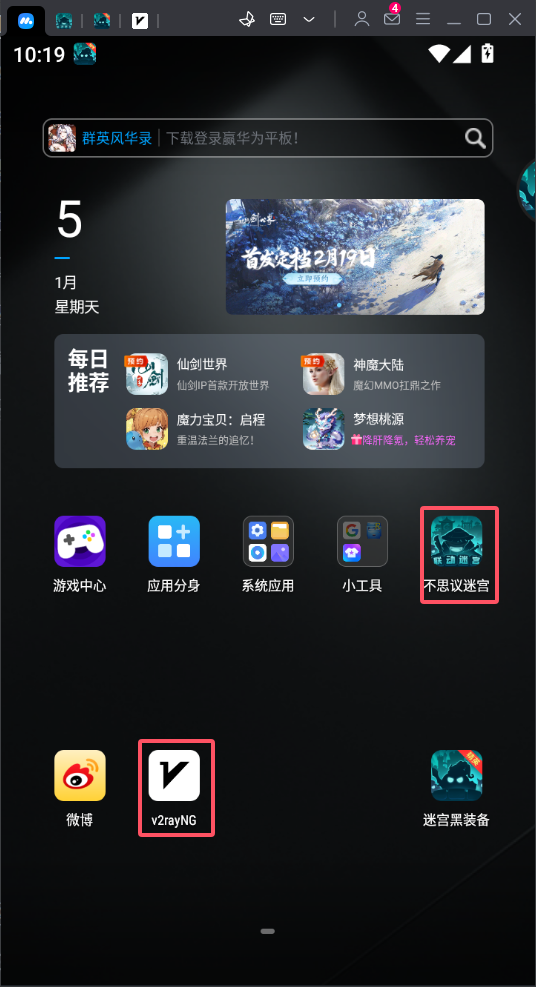
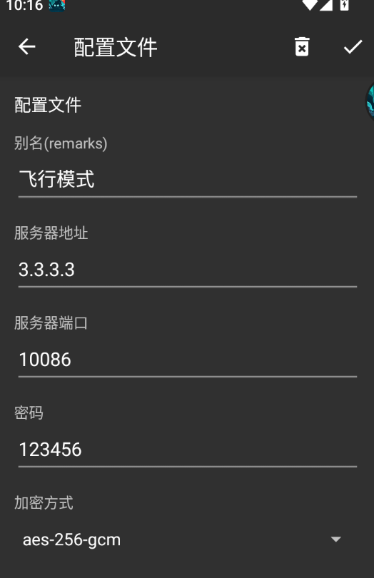

根据ljy65535的脚本修改而来
链接如下：https://github.com/ljy65535/busiyimigong/tree/master

本项目基于mumu模拟器以及python3.8.19开发。
mumu模拟器需要安装v2ray，并且配置好v2ray。
OCR模型权重需要自行下载，链接如下：
    1. 检测模型：https://paddleocr.bj.bcebos.com/PP-OCRv4/chinese/ch_PP-OCRv4_det_server_infer.tar
    2. 识别模型：https://paddleocr.bj.bcebos.com/PP-OCRv4/chinese/ch_PP-OCRv4_rec_server_infer.tar
在本项目根目录解压

### mumu模拟器显示设置

### 显示器设置

### 句柄设置

### 其他：
python version:3.8.19
目前支持的功能，黑水池，黑尸体，黑永恒。
入口是main.py，有可视化界面
当然也可以自己从其他的python代码运行。
能力有限,谢谢！

运行main.py之后，会弹出如下页面：
！[Alt text](main.png)

黑永恒使用前提：
要求有一张石肤、地震、诅咒术和多张死波，并且当前在9层或者19层（清完怪）。
模拟器主页能找到v2的APP如图所示:

v2的配置如图所示:

1. 自动测序and熔日光  -----------doing
2. 黑商店（永恒） -------------waiting
3. 黑商店（日光） -------------waiting
