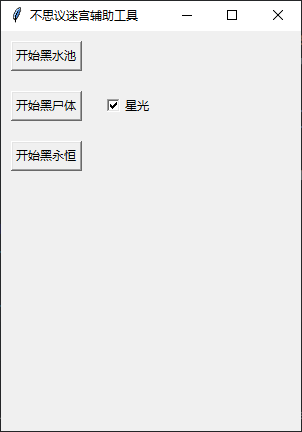

# 不思议迷宫自动化辅助工具

基于Mumu模拟器的自动化脚本工具，提供游戏内自动化操作功能

## ✨ 核心功能

- **黑水池**：自动执行黑水池相关操作,**确保铠甲在左下角**
- **黑尸体**：自动执行黑尸体（洞穴外的蓝帽子尸体以及破碎的兵器）相关操作, **确保铠甲在左下角**
- **黑永恒**：自动执行黑永恒套装操作,**确保永恒套装有的就穿上，没有的就空着, 不要穿其他装备**
- **动态加速**：实时游戏速度调节（原始/2x/5x）

## 🛠️ 环境要求

### 基础环境

- Python 3.8.19
- MuMu模拟器 (显示设置参考下文)
- V2RayN 客户端

### 依赖安装

pip install -r requirements.txt

### mumu模拟器显示设置

### 显示器设置

### 句柄设置

### 其他

python version:3.8.19
目前支持的功能，黑水池，黑尸体，黑永恒, 游戏加速。
入口是main.py，有界面
当然也可以自己从其他的python代码运行。
能力有限,谢谢！

运行main.py之后，会弹出如下页面：
！[Alt text](main.png)

黑永恒使用前提：
要求有一张地震和多张死波，并且当前在9层或者19层（清完怪）。
模拟器主页能找到v2的APP如图所示:

v2的配置如图所示:

1. 自动测序and熔日光  -----------doing
2. 黑商店（永恒） -------------waiting
3. 黑商店（日光） -------------waiting

### ⚠️ 注意事项

OCR识别存在约0.3-0.5秒延时
黑永恒需保持模拟器窗口置顶，其他不需要
脚本执行期间鼠标进行拖拉拽可能会影响脚本
建议关闭系统通知弹窗
战斗场景保持默认视角
📜 版本历史
版本 日期 更新说明
v1.0.1 2025-02-20 新增加速功能，修复之前已知的问题
v1.0.0 2025-01-07 基础功能实现
📄 许可协议
MIT License

🙏 致谢
基于 (<https://github.com/ljy65535/busiyimigong/tree/master> "ljy65535/busiyimigong") 二次开发
(<https://paddlepaddle.github.io/PaddleOCR/latest/index.html> "PaddleOCR")提供文字识别支持
