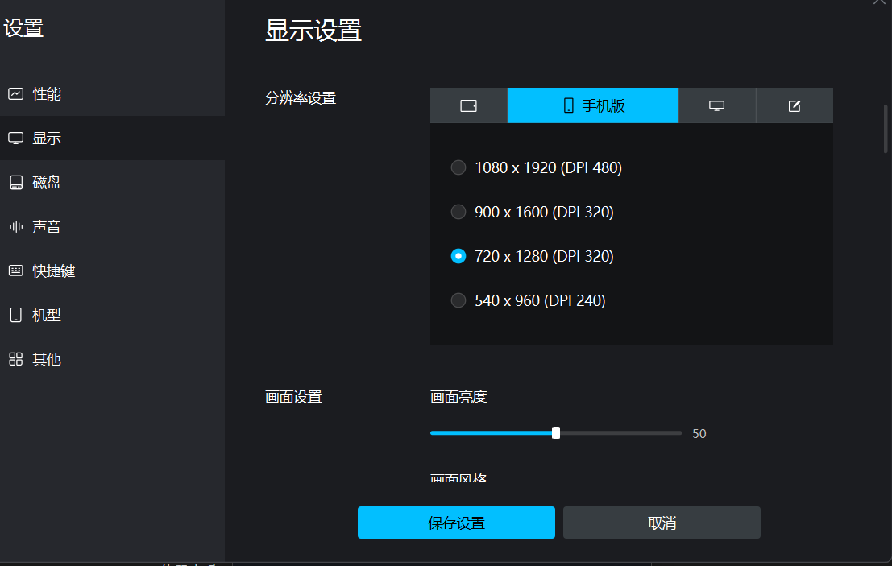
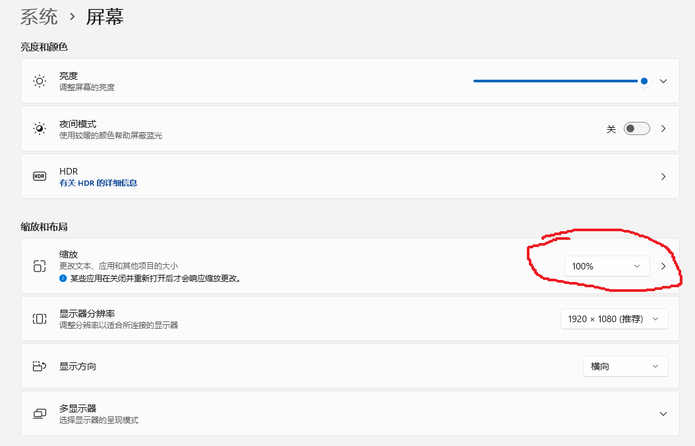
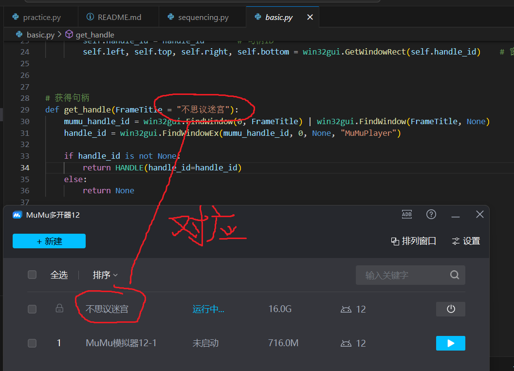

根据ljy65535的脚本修改而来
链接如下：https://github.com/ljy65535/busiyimigong/tree/master

### mumu模拟器显示设置

### 显示器设置

### 句柄设置

### 其他：
python version:3.8.19
目前支持的功能，黑水池，黑尸体，黑永恒。
入口是gui.py，有可视化界面
当然也可以自己从其他的python代码运行。
能力有限，轻喷！

1. 自动测序and熔日光  -----------doing
2. 黑商店（永恒） -------------waiting
3. 黑商店（日光） -------------waiting
